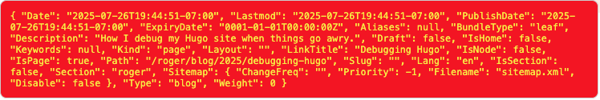

+++
title = 'Debugging Hugo'
description = 'How I debug my Hugo site when things go awry.'
date = 2025-07-26T19:44:51-07:00
tags = [ "hugo", "debugging"]
layout = 'blog/single'
+++

# Credit
I found [this](https://write.rog.gr/writing/various-ways-to-debug-in-hugo/) wonderful post by [Roger Steve Ruiz](https://write.rog.gr/) about how to embed debug information into your Hugo site and took liberal inspiration from it. In fact the initial commits I made were simply copied directly from this post.

# Debug Box (printf everything)
One area that I diverged from Ruiz was to make the debug information only appear when a Site variable is set to true:
```toml
[Params]
  debug = false
```
I created a partial that is part of `layouts/_defaults/baseof.html` so that it is displayed just above the "content" portion of every single page on the site. This is what it looks like:



Here is a snapshot of the partial (`layouts/partials/debug/printf.html`), which as you can see simply dumps all debug output that Hugo generates in a big string:
```html
{{ if .Site.Params.debug }}

<div class="debugBox">
  <code>{{ debug.Dump . }}</code>
</div>

{{ end }}
```
# Meta-Tags
The second debug feature is more structured, but only visible when using developer tools to view the page's `<HEAD/>` tags.

```html
<!-- Debug info only available when HUGO_PARAMS_DEBUG=true -->
<meta name="hugo-bundle-type" content="leaf">
<meta name="hugo-categories" content="">
<meta name="hugo-fuzzy-word-count" content="200">
<meta name="hugo-is-home" content="false">
<meta name="hugo-is-node" content="false">
<meta name="hugo-is-page" content="true">
<meta name="hugo-keywords" content="[]">
<meta name="hugo-kind" content="page">
<meta name="hugo-lastmod" content="2025-07-26 19:44:51 -0700 PDT">
<meta name="hugo-prev-in-section" content="/roger/blog/2024/why-from-scratch/">
<meta name="hugo-file-path" content="roger/blog/2025/Debugging-Hugo/index.md">
<meta name="hugo-section" content="roger">
<meta name="hugo-type" content="blog">
<meta name="hugo-tag" content="hugo">
<meta name="hugo-ancestor" content="/roger/blog/">
<meta name="hugo-ancestor" content="/roger/">
<meta name="hugo-ancestor" content="/">
<meta name="hugo-parent" content="/roger/blog/">
<meta name="hugo-parent-kind" content="section">
<meta name="hugo-parent-type" content="blog">
<!-- End debug info -->
```

I just leave this on all the time, exactly as Roger Ruiz also suggested, defined in `layouts/partials/debug/meta-tags.html`, keeping it guarded with a simple check: `{{ if hugo.IsServer }}`.

# Liberal Dosing of H1 Tags to Decode Templates
It's an absolute requirement to always know what templates in the `layout/` folder are used to render which pages. To figure this out I peppered most of my templates with temporary tags such as:
```html
<h1>layouts/_default/section.html</h1>
```
While this is quite ugly, it got the job done. I then created a table for future me to reference. This was very important since I created the *structure* of this site in October of 2024, but didn't really dig into Hugo very deep until July of 2025. 

Here is a master list of each type of page on the site, a short description, and the templates that are activated in order to render each:

## content/
Root of the site. Displays the userboxes for jumping off into the individual user pages.
* layouts/_default/baseof.html
* layouts/index.html
* layouts/partials/avatar-image.html
* layouts/partials/footer.html
* layouts/partials/header/home-header.html
* layouts/partials/header/section-header.html

## content/disclaimer
Legal disclaimer.
* layouts/_default/baseof.html
* layouts/_default/single.html
* layouts/partials/page.html

## content/(user)
This is the user page, as in [this example](http://fleig.us/roger).
* layouts/_default/baseof.html
* layouts/_default/section.html
* layouts/partials/home.html
* layouts/partials/avatar-image.html

## content/(user)/about
This is where the resume information is hosted.
* layouts/_default/baseof.html
* layouts/_default/single.html
* layouts/partials/page.html

## content/(user)/blog/
This is where all blog entries are listed along with publish date.
* layouts/_default/baseof.html
* layouts/blog/list.html

## content/(user)/blog/(year)/(article-title)
These are blog articles.
* layouts/_default/baseof.html
* layouts/blog/single.html

# Conclusion
I am always learning and continue to get inspriration from other Hugo site developers as I find them, so I am sure I will have more to say on debugging later. Some areas that I am considering:
* A pop-up debug panel that has more relevant information (such as the name of the layout template).
* Some shortcodes to render the information in the previous section in a more "beautiful" way.
* Perhaps an article and and approach that connects layouts to css to content - to make it easier to jump in and fix things.
* Some insights into naming. I am slowly growing to appreciate semantic HTML tagging to avoid the numerous conflicts that I have already experienced.